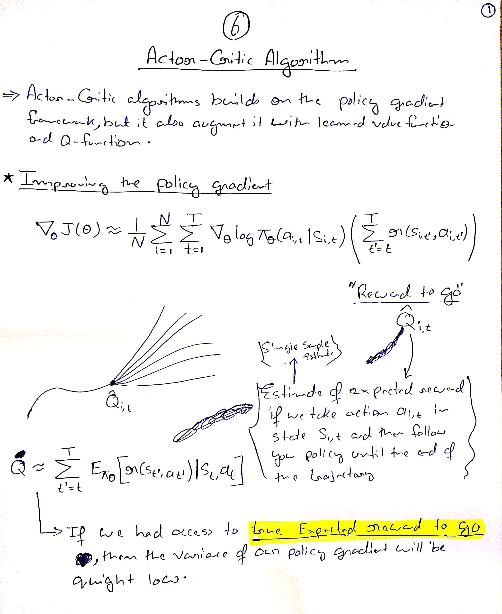
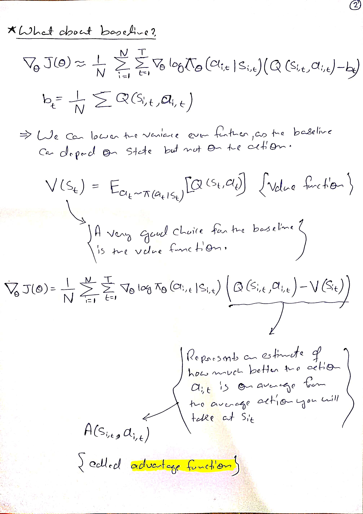
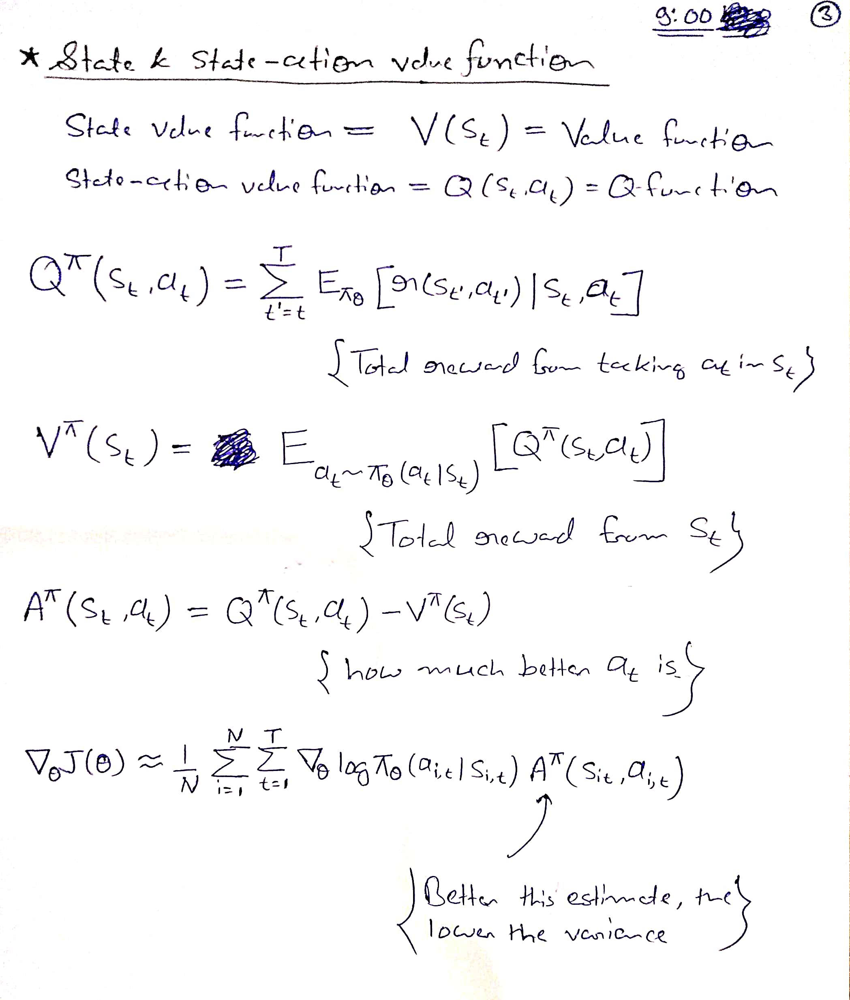
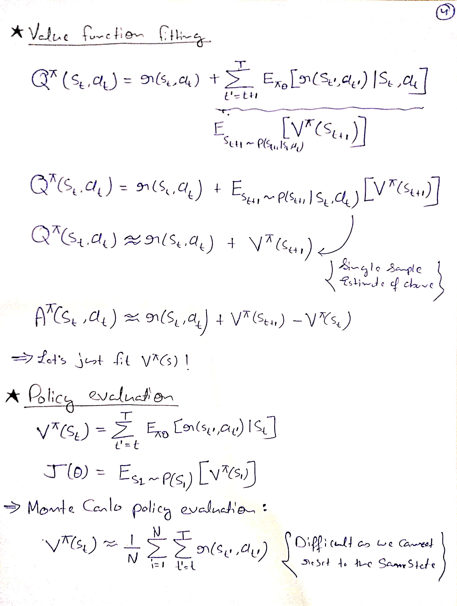
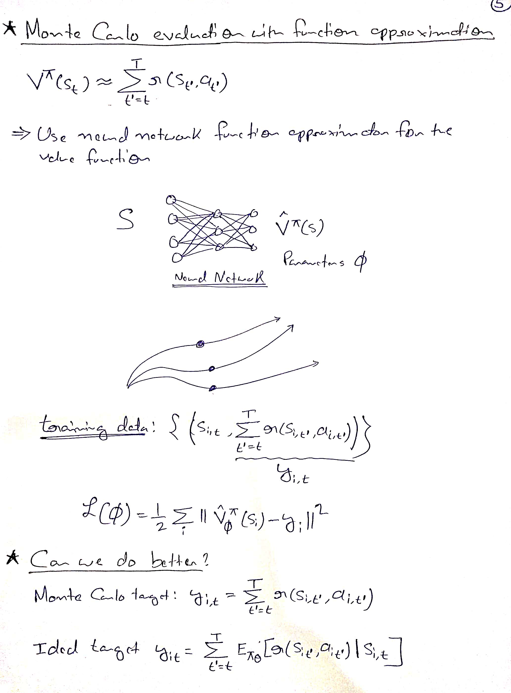
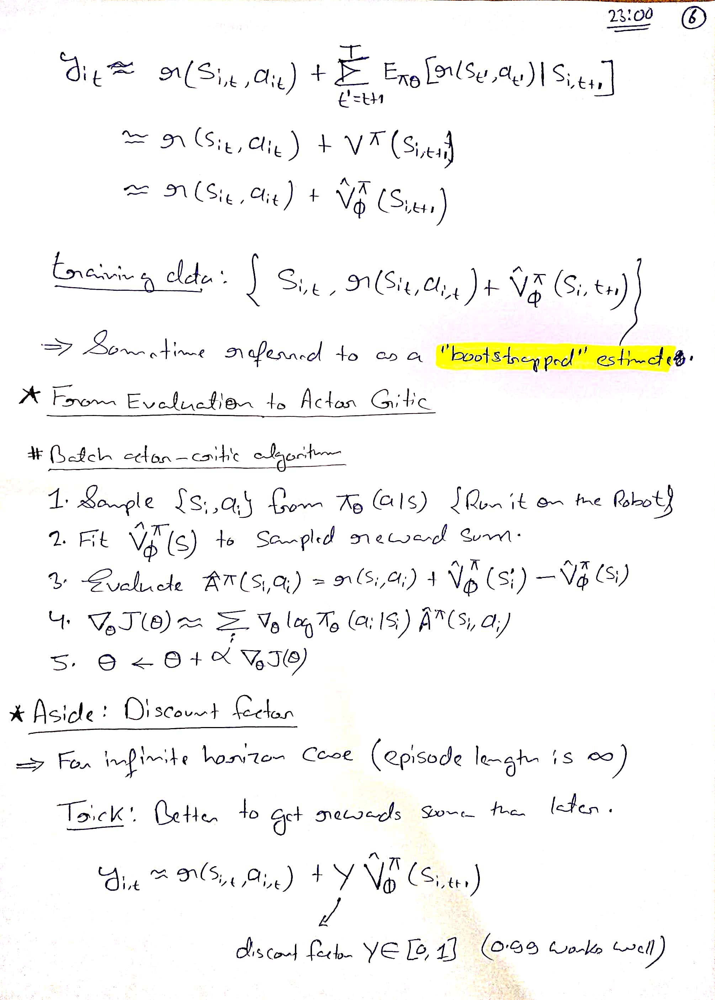
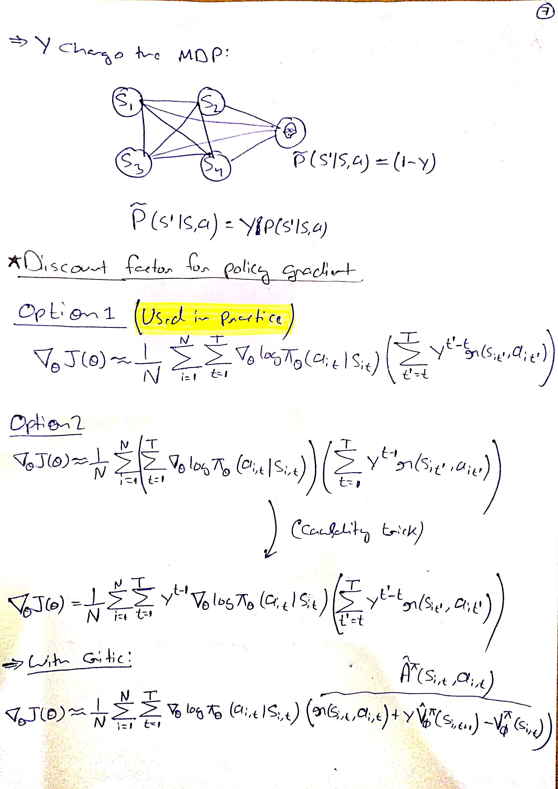
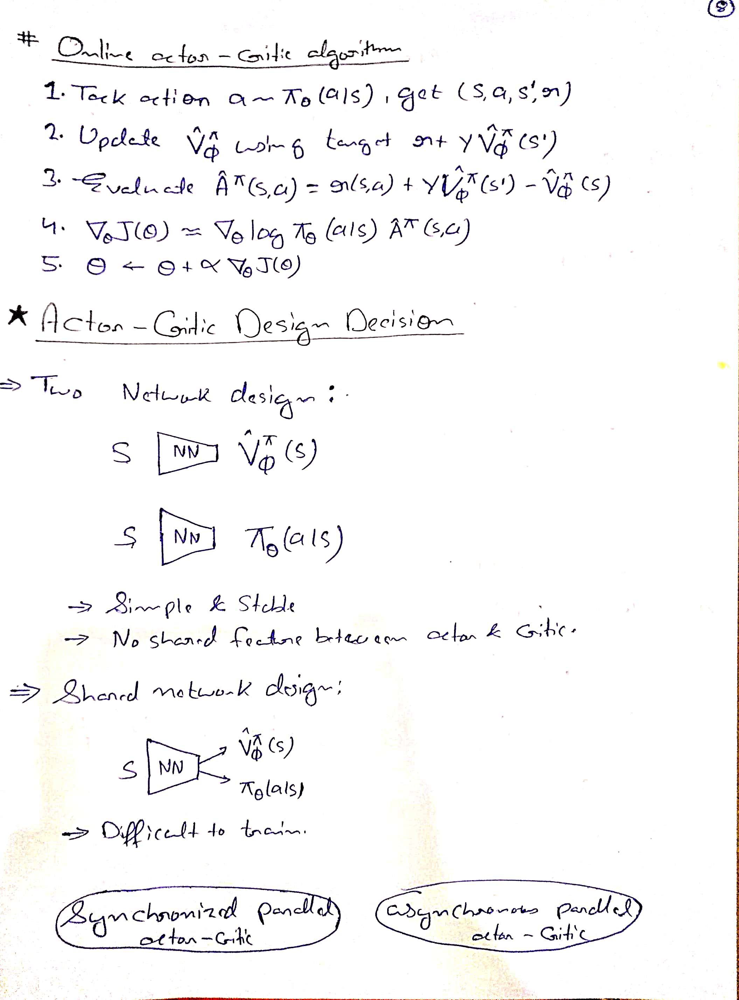
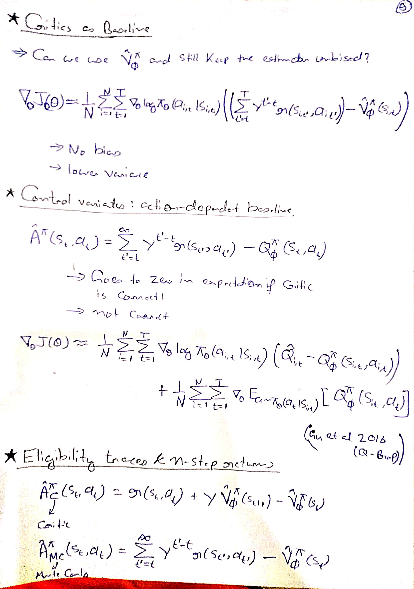
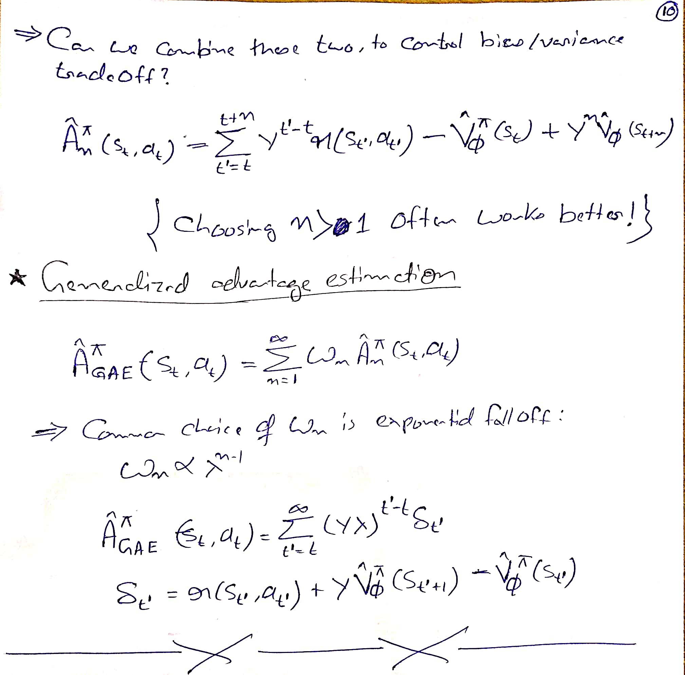

# Actor-Critic Algorithm

# Actor Critic Method
As an agent takes actions and moves through an environment, it learns to map the observed state of the environment to two possible outputs:
1. Recommended action
    * The part of the agent responsible for this output is called the **actor**.
2. Estimated rewards in the future
    * The part of the agent responsible for this output is the **critic**.

Agent and Critic learn to perform their tasks, such that the recommended actions from the actor maximize the rewards.

# HandWritten Notes

<p\>
