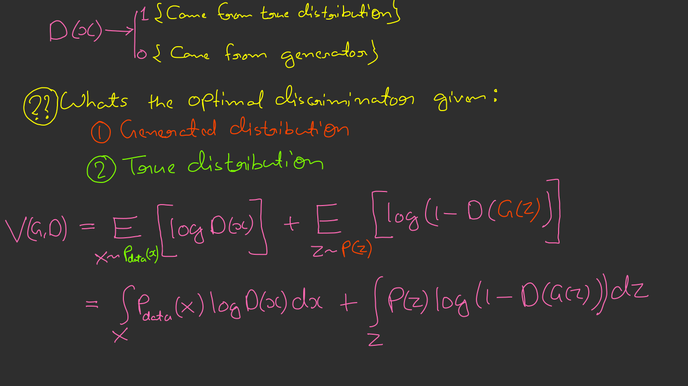
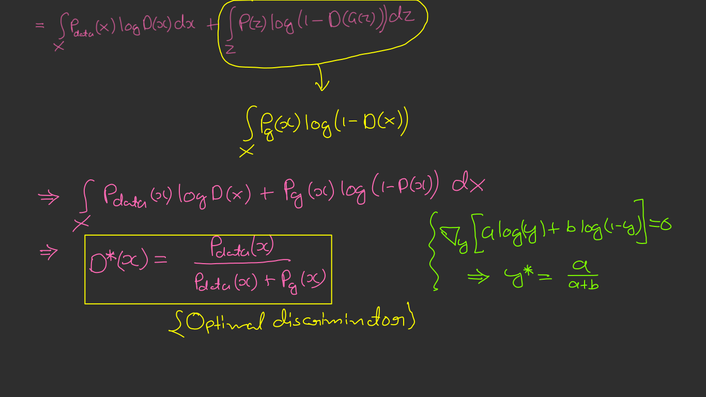
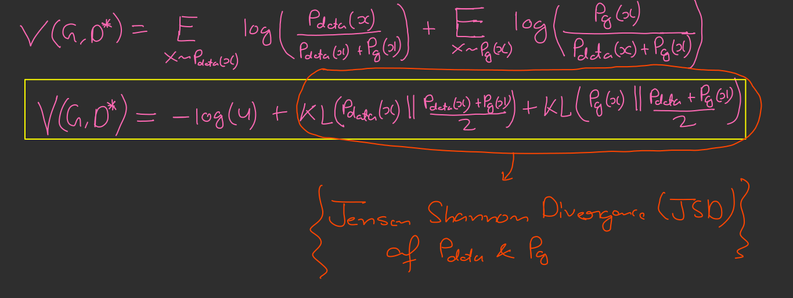
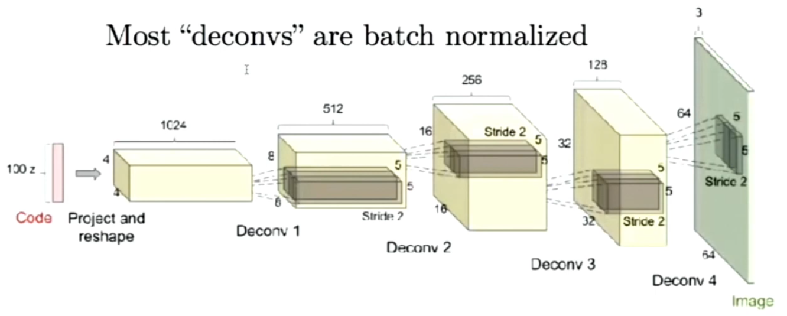
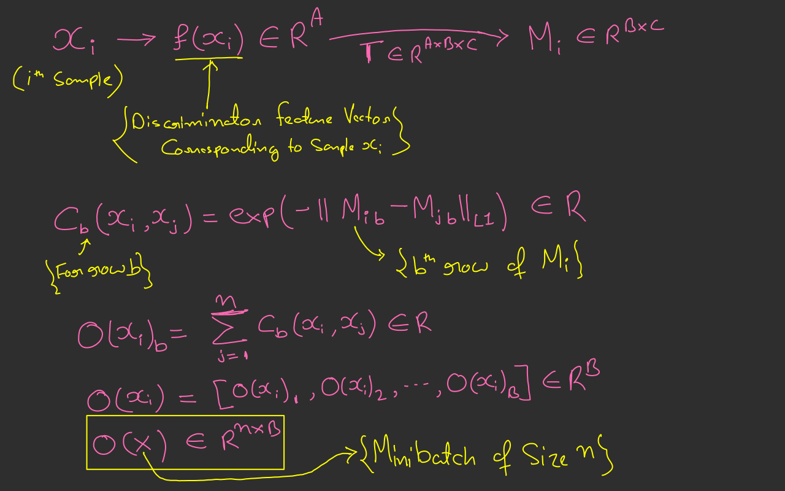

# GAN

## Implicit Models
- Sample z from a fixed noise source distribution (Uniform or Gaussian).
- Pass the noise through a deep neural network.
- Learning the deep neural network without explicit density estimation.
```mmd
graph LR;
  z([z]) -->|DNN|x([x]);
```
- Given samples from data distribution $p_{data}: x_1, x_2, ... x_n$
- Given a sample $x_\phi(z) =  DNN(z; \phi)$ where $z \sim P(z)$
- $x = q_\phi(z)$ induce a density function $P_{model}$
  - Do not have a explicit form for $P_{data}$ or $P_{model}$, but can only draw samples.
  - Make $P_{model}$ as close to $P_{data}$ as possible by learning an appropriate $\phi$

## Departure from maximum likelihood
- We need a measure of how far apart $P_{data}$ and induced $P_{model}$ are.
- With density model, we used $KL(P_{data}||P_{model})$ which gave us the objective $E_{x \sim P_{data}} [ log P_{\theta}(x)]$, where we explicitly modeled $P_{model}$  as $P_{\theta}(x)$.
- Not having an explicit $P_{\theta}$ requires us to come up with with a distance measure that potentially behave differently from maximum likelihood.
  - Example: Maximum Mean Discrepancy (MMD), Jensen Shonnon Divergence (JSD), Earth Mover's Distance etc...

## Original GAN
$$\min_{G} \max_{D} E_{x \sim P_{data}} [log D(x)] + E_{z \sim P(z)} [log(1-D(G(z)))]$$

The above equation is the GAN objective!!

Two player minmax game between Generator(G) and Discriminator(D).

  1. **G:** Generator
    - Tries to minimize the log-probability of its samples being classified as fake by the discriminator(D).

  2. **D:** Discriminator
    - Tries to maximize the log-likelihood for the binary classification problem:

```mmd
graph LR;
  G -->|Real|1
  G -->|Fake|0
```

```c
for number of training iteration do
  for k steps do
    * Sample minibatch of m noise samples ${ z^{(1) ... z^{(m)}}$
    from noise Prior $P_g(z)$
    * Sample minibatch of m examples ${ x^{(1) ... x^{(m)}}$ from
    data generating distribution $P_{data}(x)$
    * Update the discriminator by ascending its stochastic gradient
    (eq 1)
  end for
  * Sample minibatch of m noise samples ${ z^{(1) ... z^{(m)}}$
  from noise Prior $P_g(z)$
  * Update the generator by descending its stochastic gradient.
  (eq 2)
end for
```
$$\nabla_{\theta_d} \frac{1}{m} \sum_{i=1}^{m} log D(x^{(i)}) + log(1 - D(G(z^{(i)}))) --- (1) $$
$$\nabla_{\theta_g} \frac{1}{m} \sum_{i=1}^{m} log(1 - D(G(z^{(i)}))) --- (2) $$

## How to Evaluate
- Evaluation of GAN is **still an open problem**.
- Unlike density model, you cannot report explicit likelihood estimate on test sets.

### Inception Score
**Idea:** Good generator generate samples that are semantically diverse. 

**Semantic Predictor:** Trained Inception Network v3
  - $P(y|x)$, $y$ is one of 1000 ImageNet Class

**Conciderations:**
  1. Each Image x should have distinctly recognizable object.
    - $P(y|x)$ should have low entropy.
  2. There should be many classes generated as possible.
    - $P(y)$ should have high entropy.
    - $P(y) = \sum_x P(x)P(y|x) $

$$IS = exp(E_{x \sim P_g} [ D_{KL}[P(y|x)||P(y)]])$$
$$IS = exp(H(y) - H(y|x))$$

### Frechet Inception Distance (FID)
- Inception score doesn't sufficiently measures diversity.
  - A list of 1000 images (One of each class) can obtain a perfect score.
- FID was proposed to more nuances.

**Idea:** Embed image into some feature space (2048 Dim activation of Inception v3 pool 3 layer) then  compare mean and covariance of those random features.

## Key pieces of GAN
1. Fast Sampling
2. No Inference
3. Notion of Optimizing directly what you care about (i.e. perceptual samples)

## Some Theory
### GAN: Bayes-Optimal Discriminator




### Mode covering vs Mode seekink: Tradeoffs
- **For Compression:** Would prefer to ensure all points in the data distribution are assigned probability mass.
- **For Generating Good Samples:** Blurring across modes spoils perceptual quality because regions outside data manifold are assigned non-zero probability mass.
  - Picking one mode without assigning probability mass on points outside can produce _better-looking_ samples.
- **Caveat**: More expressive density models can place probability mass more accuretly.

### Discriminator Saturation
```mmd
graph LR;
  a(Optimize Discriminator given Generator to compleation) --> b(Generator samples confidently classified as fake by the <br> discriminator receives no gradient for the generator update);
```
### Avoiding Discriminator Saturaation:
1. Alternating Optimization
   - Alternating gradient steps on discriminator and generator objectives 
   - Balancing these two updates is hard for the zero-sum game.
   - Goodfellow seggests modifying the generator objective to make the adversarial game non-zero sum and help address the saturation problem.
2. Non Saturaating Formulation
  - We modify the generator objective:
    - From $$\min_{G} E_{z \sim P(z) log(1 - D(G(z)))}$$ to $$\max_{G} E_{z \sim P(z) log(D(G(z)))}$$

## GAN Progressions
### DC GAN (Radford et al, 2016)
**DC GAN:** Deep Convolutional Generative Adversarial Network



- Input image is normalized to [-1, 1] (i.e. $\frac{x}{127.5} - 1$)
- While generating image we apply tanh nonlinearity to output to force it to be within [-1, 1]
- **Deconv:** Transpose Conv (i.e. backward pass of Conv)

#### Architecture Design
- Supervised Learning CNNs not directly usable for GAN
  - Remove max-pooling and mean-pooling.
  - Upsampling using transposed convolutionsin the generator.
  - Downsampling with strided convolutions and average pooling.
  - Non-Linearinty: ReLU for generator, Leaky-ReLU (0.2) for discriminator.
  - Output Non-Linearity: tanh for Generator, sigmoid for discriminator.
  - Batch Normalization used to prevent mode collapse
  - Batch Normalization is not applied at the output of G and input of D
- Optimization detail
  - Adam: small LR: 2e-4; small momentum: 0.5, batch-size: 128

#### Conclusions
- Incredible samples for any generative model
- GANs could be made to work well with architecture details
- Perceptually good samples and interpolations
- Representation Learning
- Problems to address:
  -  Unstable training
  - Brittle architecture / hyperparameters

### Improved Training of GANs (Salimans et al, 2016)
1. Feature Matching
   - Modified generator objective: $$||E_{x \sim P_{data}} f(x) - E_{z \sim P(z)} f(G(z))||^2$$, where f is intermidiate feature in the discriminator.
2. Minibatch discrimination
   - **Motivation:**  Discriminator needs to make sure that generator generates a diverse set of samples, not just few realistic looking samples.
   - 
   - You concatinate $[f(x), o(x)]$ and pass it to the next layer of discriminator.

<1:28:31>
