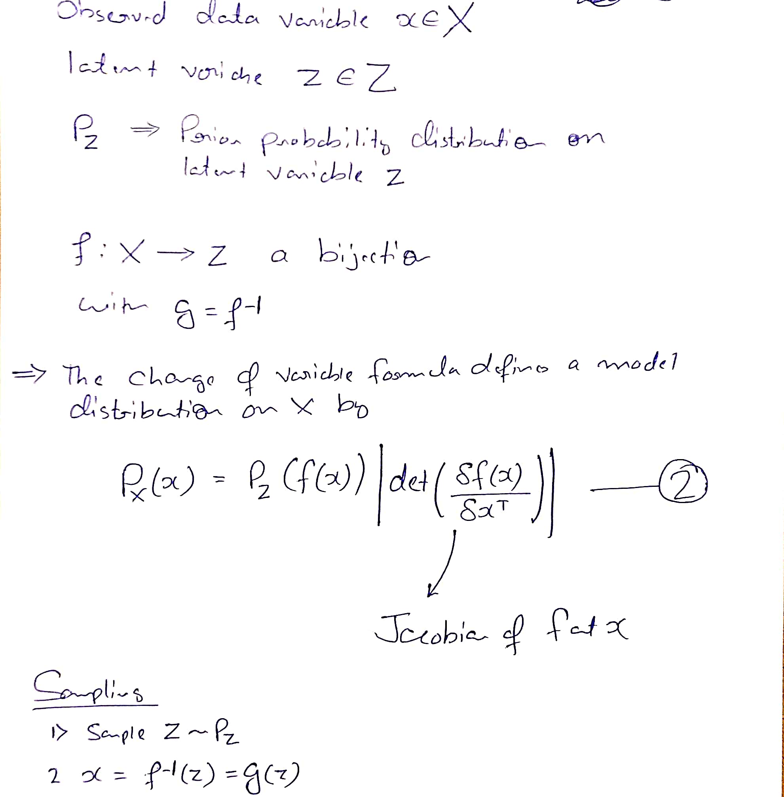
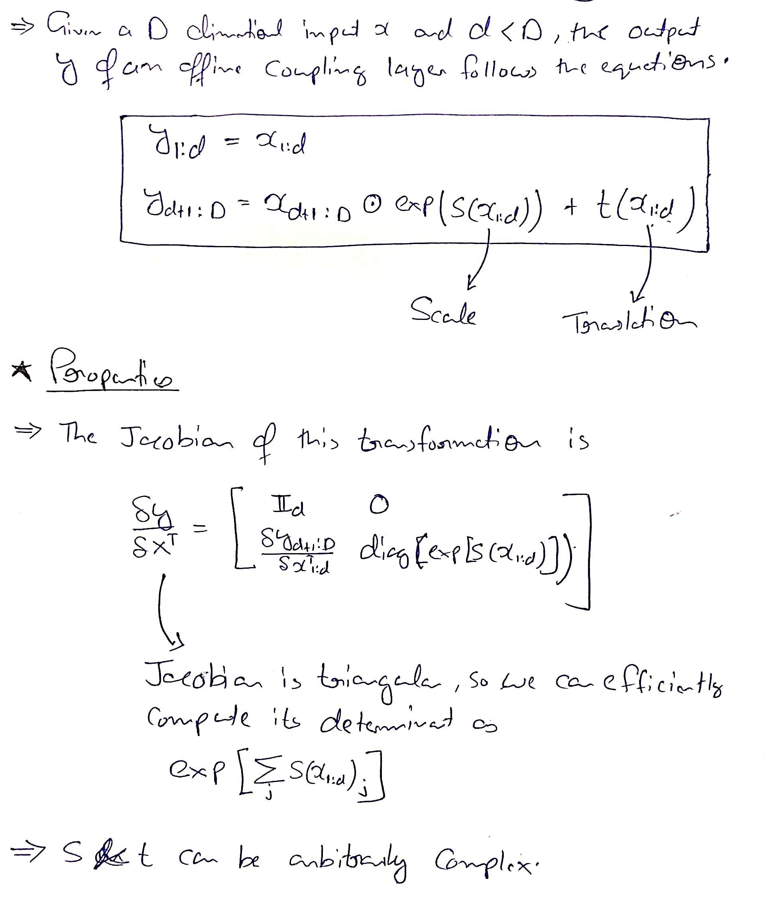
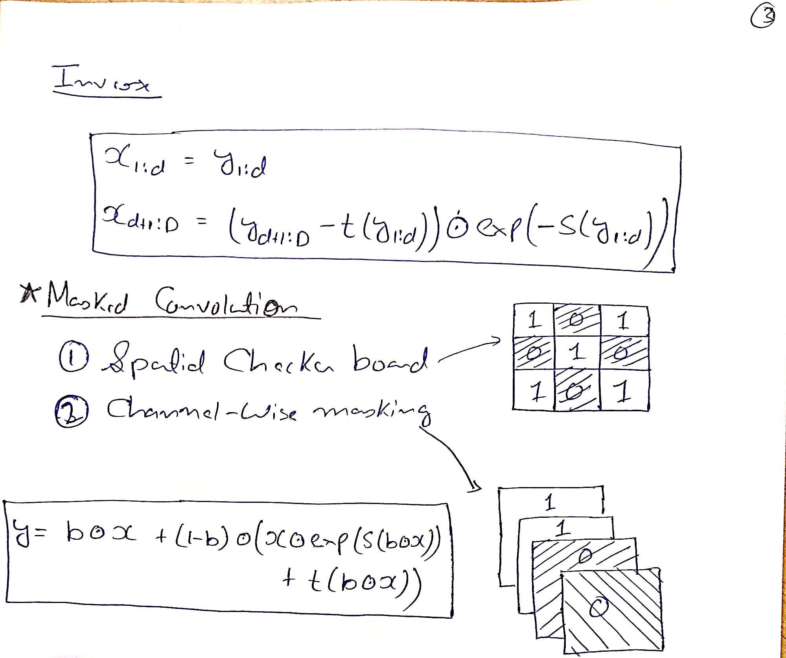
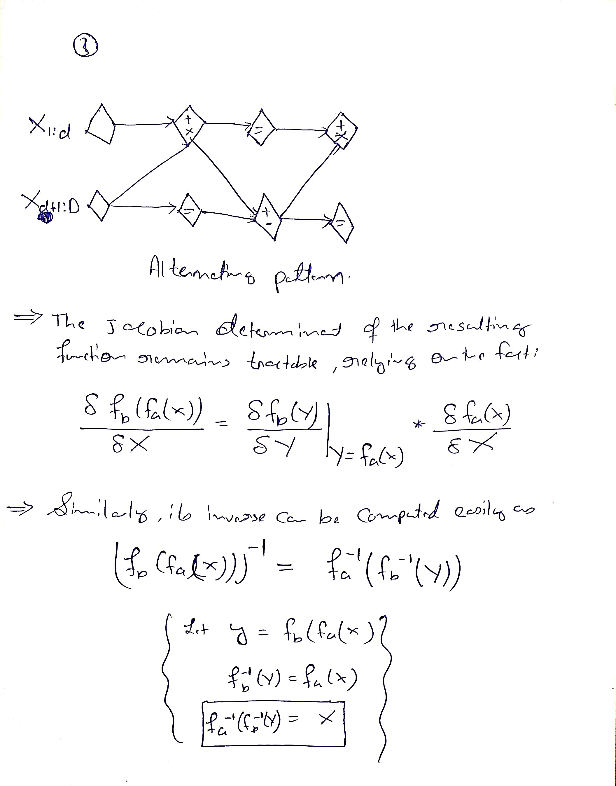
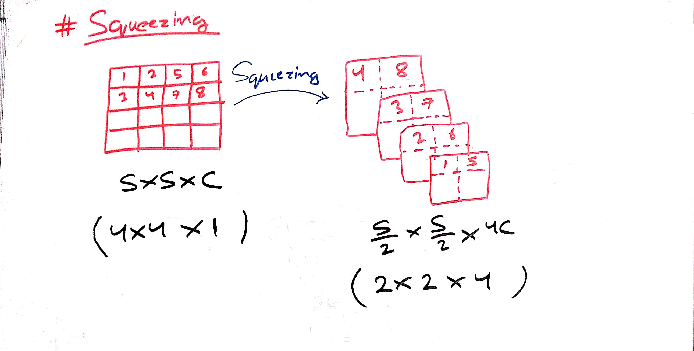
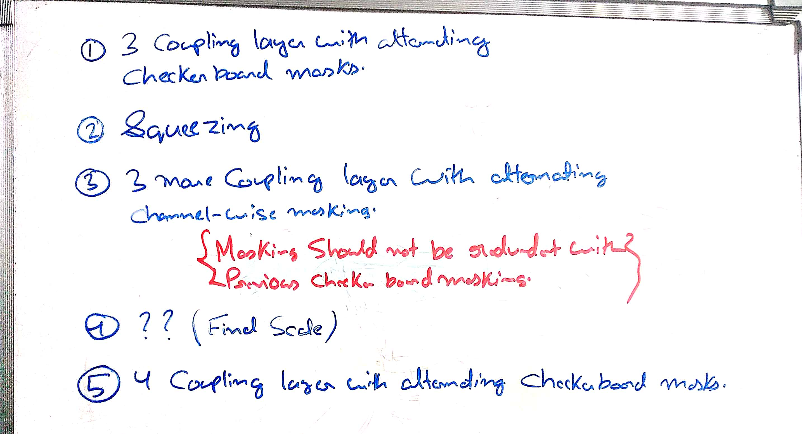
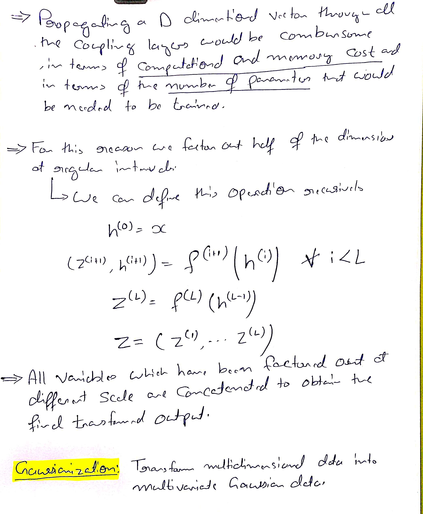

# Model Definition

In this paper, we will tackle the problem of learning **highly nonlinear** models in **high-dimensional** **continuous spaces** through maximum likelihood.

## Change of variable formula

## Coupling layer
Computing the **Jacobian** of functions with high-dimensional domain and codomain and computing the **determinants** of large matrices are in general **computationally very expensive**.

This combined with the restriction to bijective functions makes Equation 2 appear impractical for modeling arbitrary distributions.

By careful design of the function f, a bijective model can be learned which is both tractable and extremely flexible.
  - This work exploits the simple observation that the determinant of a triangular matrix can be efficiently computed as the product of its diagonal terms.

We will build a flexible and tractable bijective function by stacking a sequence of simple bijections.

In each simple bijection, part of the input vector is updated using a function which is simple to invert, but which depends on the remainder of the input vector in a complex way.
  - We refer to each of these simple bijections as an **affine coupling layer**. 

## Combining coupling layers
Although coupling layers can be powerful, their forward transformation leaves some components unchanged.
  - This difficulty can be overcome by composing coupling layers in an alternating pattern, such that the components that are left unchanged in one coupling layer are updated in the next.

## Multi-scale architecture

## Batch normalization
To further improve the propagation of training signal, we use **deep residual networks** with **batch normalization** and **weight normalization** in s and t.
  - We introduce and use a novel variant of batch normalization which is based on a **running average over recent minibatches**, and is thus more robust when training with very small minibatches.
  - This form of batch normalization can be seen as similar to **reward normalization** in deep reinforcement learning.
