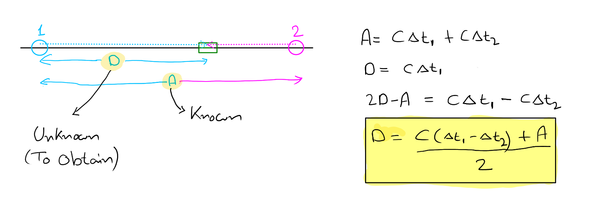

# How position is determined by the GNSS

## Basic Principle

- Satellite with a known position transmit a regular time signal.

- Based on the measured travel time of the radio wave, the position of the reciever is calculated.

- Time of the clock on-board, may not be exactly synchronized with the clock at the transmitter. So there can be discrepancy between the calculated and actual distance travelled.

- **pseudorange:** In navigation, observed distance referenced to the local clock is referred to as pseudorange.

  ### Solution to time synchronized issue (1D)

  - 
  - The solution involves using a second synchronized time signal transmitter, for which the seperation to the first transmitter is known.