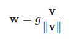

Applies weight normalization to a parameter in the given module.



Weight normalization is a reparameterization that decouples the magnitude of a weight tensor from its direction.

This replaces the parameter specified by name (e.g. 'weight') with two parameters:
  1. weight_g
  2. weight_v

```python
torch.nn.utils.weight_norm(module, name='weight', dim=0)
```
