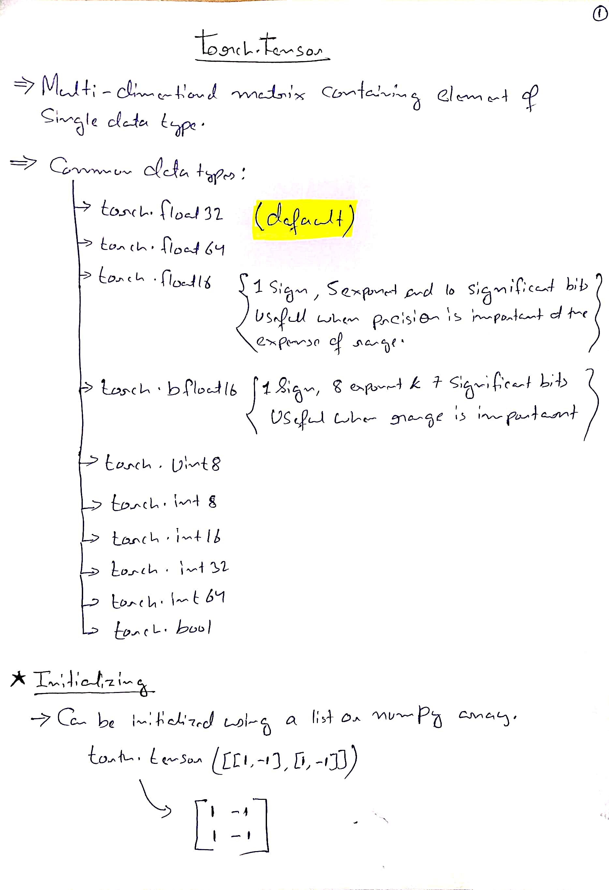
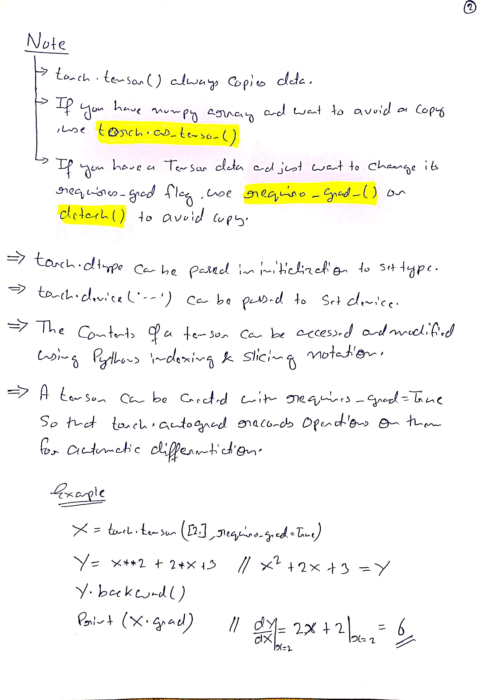
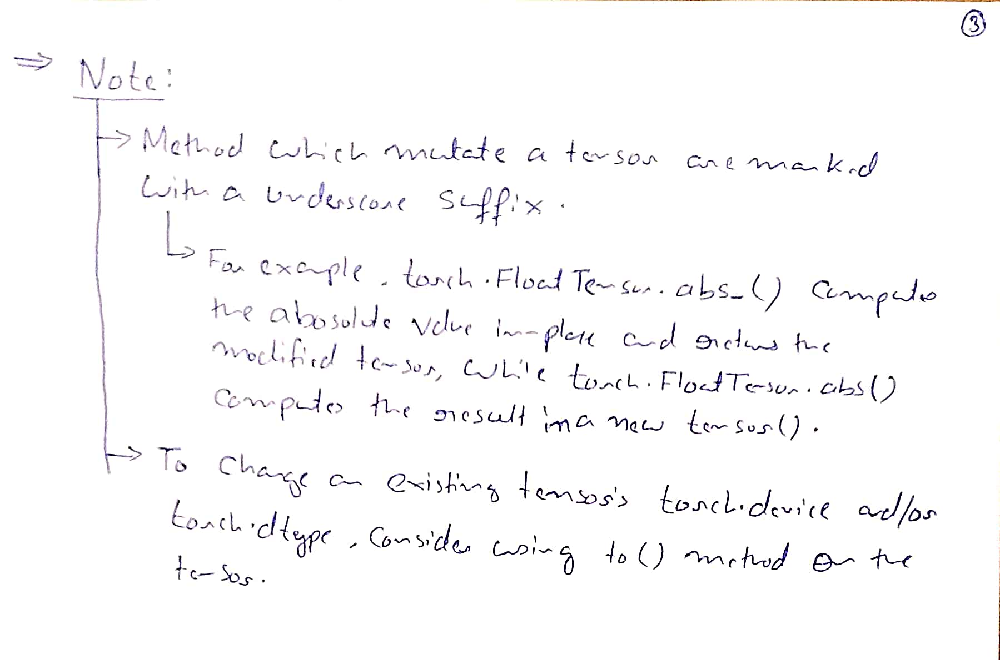

# tensor
1. [*.contiguous()](./*.contiguous()/index.md)
2. [*.cuda() vs *.to(cuda)](./*.cuda()%20vs%20*.to(cuda)/index.md)
3. [tensor.item()](./tensor.item()/index.md)
4. [view](./view/index.md)
5. [scatter](./scatter/index.md)

## Markdown Notes
#### self.long()
self.long() is equivalent to self.to(torch.int64)

# HandWritten Notes

<p\>
