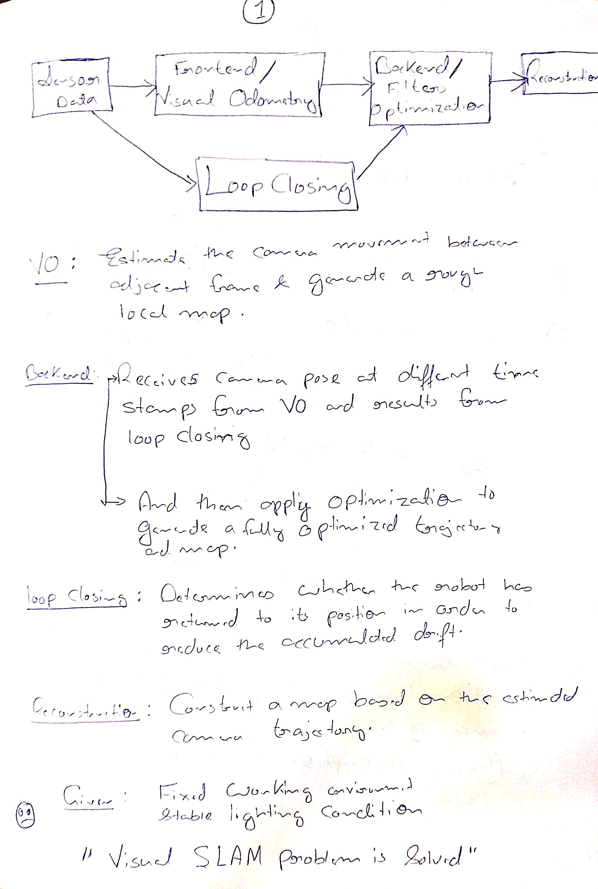
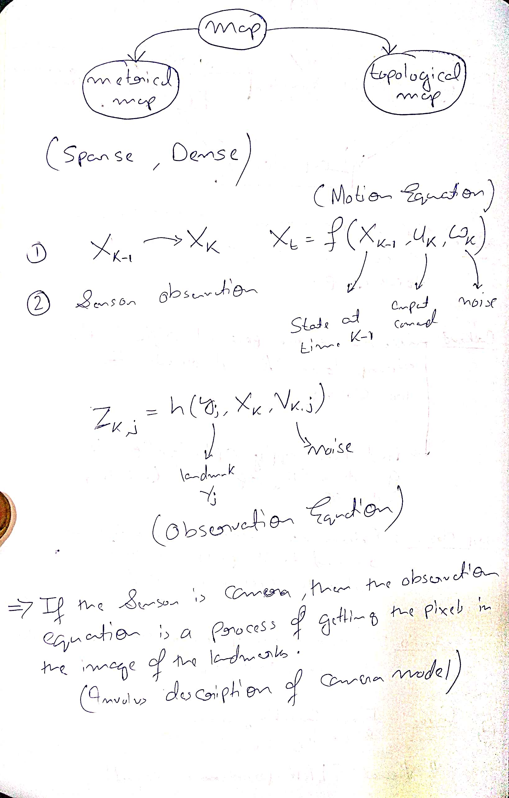
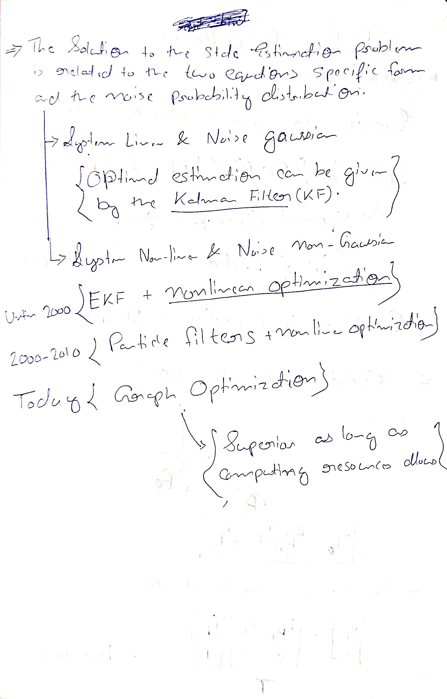

# Introduction to SLAM

Many different approaches to slove localization problem:
1. Guiding rail
2. Paste a lot of artificial markers
3. Radio localization devices
4. GNNS Receiver

Sensors:
1. non-intrusive sensors:
    1. Entirly self contained inside a robot.
    2. Wheel encoder, cameras, laser scaner etc.
2. intrusive sensors:
    1. Depends on prepaired environment.
    2. guiding rails, artificial markers etc.
    3. Intrusive sensors can usually locate a robot directly, solving the localization problem in a simple and effective manner.

## Monocular Camera
- Trajectory and map obtained from monocular SLAM estimation will differ from the actual trajectory and map with an unknown factor, which is called the scale.
- Since monocular SLAM can not determine this real scale purely based on images, this is also called the **scale ambiguity**.

## Stereo Camera
- A stereo camera consists of two synchronized monocular cameras, displaced with a known distance, namely the baseline.
- The longer a baseline is, the farther it can measure. 
- The disadvantage of stereo cameras or multi-camera systems is that the configuration and calibration process is complicated.

## RGB-D Cameras
- Most of the RGB-D cameras still suffer from issues including narrow measurement range, noisy data, small field of view, susceptibility to sunlight interference, and unable to measure transparent material.
- RGB-D cameras are mainly used in indoor environments and are not suitable for outdoor applications.

# HandWritten Notes

<p\>
