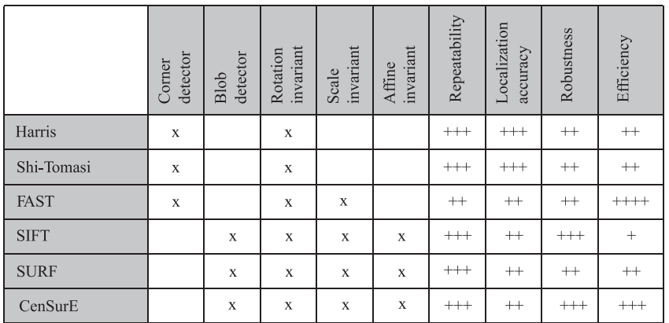

# Visual Odometry (Part 2): Matching, Robustness, and Applications

## References
* [paper](https://www.zora.uzh.ch/id/eprint/71030/1/Fraundorfer_Scaramuzza_Visual_odometry.pdf)

## Feature Selection and Matching
There are two main approaches to finding feature points and there correspondeces:
1. **Feature Tracking:** Find feature in one image and track them in the next image.
2. **Feature Matching:** Detect feature independently in all the images and match them based on some similarity metric between there descriptors.

The former is more sutable when the images are taken from nearby viewpoints, whereas the latter is more suitable when large motion or viewpoint change is expected.

### Feature Detection
During the feature-detection step, the image is searched for salient keypoints that are likely to match well in other images.

**Local Feature:** Image pattern that differs from its immediate neighborhood in terms of intensity, color, and texture.
- For VO, point detectors, such as corners or blobs, are important because there position in the image can be measured accurately.

**Corner:** A point at the intersection of two or more edge.

The appealing properties that a good feature detector should have:
1. **Localization accuracy**
2. **Repeatability:** Large number of features should be re-detected in the next images
3. **Computational efficiency**
4. **Robustness:** To noise, compression artifacts, blur
5. **Distinctiveness:** Features can be matched accuratly across different images
6. **Invarient:** To Photometric changes (eg illuminations) and geometric changes (eg rotation, scale)

| Corner Detector  |   Blob Detector   |
|:----------------:|:-----------------:|
| Fast to compute  |  Slow to compute  |
| Less Distinctive |  More Distinctive |

Every feature detector consists of two stages:
1. Apply a feature-response function on the entire image.
2. Apply non-maxima suppression on the output of the first step.
    - The gole is to identify all local minima (or maxima) of the feature-response function.

- SIFT detector is found to give outstanding results for VO.
- The SURF detector builds upon the SIFT and has faster computation compared to SIFT.

## Feature Descriptor
> The region around each detected feature is converted into a compact descriptor that can be matched against othe descriptor.

- The simplest descriptor of a feature is "intensity of picels" in the patch around the feature point.
    - In this case, error metrics such as givel bellow can be used to compare intensities.
      1. Sum of squared difference (SSD)
      2. Normalized cross correlation (NCC)
      3. Census transform (Robust)

- Local appearance of the feature is not a good descriptor of the information carried by the feature because its appearance will change with orientation, scale, and viewpoint changes.

- The SIFT descriptor proved to be very stable against changes in illumination, rotation, and scale, and even up to 60 degree changes in viewpoint.

- Between 2010 to 2011, three new descriptor have been devised, which are much faster to compute then SIFT and SURF.
  1. **BRIEF:** Extremely fast but, works in absence of rotation and scale change.
  2. **ORB:** Inspired by success of BRIEF, tackels orientation invariance and optimization of sampling scheme.
  3. **BRISK:** Based on FAST, allows scale and rotation invariance.

